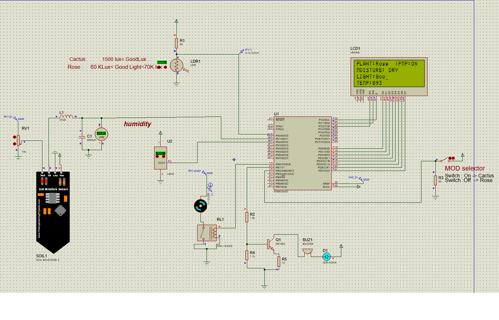

# AVR_IrigationSystem
a simple AVR based embedded system that controles irrigation of a plant
<h1>Introduction:</h1>
<h4>it's a simple embedded system that irrigates a selected plant (cactus or rose) according to measuring light intensity , environment temperature and soil moisture .</h4>

<h1>Used software and libraries:</h1>
<h4>proteus 8.13</h4>
<h4>'Soil Moisture librari' for proteus </h4>

<h1>schematic Image</h1>

